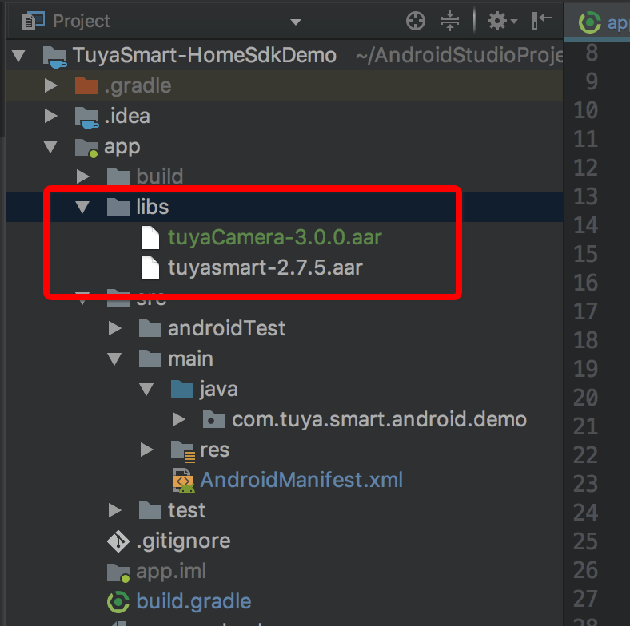

# Integrate SDK


## Preparation for Integration


###  1、Create Project

Build your project in the Android Studio.

### 2、Import aar

import tuyaCamera-3.0.x.aar to libs，etc：



### 3、Configure the build.gradle

build.gradle 

Add the following codes to the build.gradle file.

```groovy
defaultConfig {
    ndk {
        abiFilters "armeabi-v7a"
    }
 }
    dependencies {
        implementation fileTree(dir: 'libs', include: ['*.jar', '*.aar'])
        implementation 'com.alibaba:fastjson:1.1.67.android'
        implementation 'com.squareup.okhttp3:okhttp-urlconnection:3.6.0'
        implementation 'org.eclipse.paho:org.eclipse.paho.client.mqttv3:1.2.0'
    }

repositories {
    mavenLocal()
    jcenter()
    google()
}
```

> 【Tips】 TuyaSmart Camera Android sdk solely supports the platform of armeabi-v7a


### 4、Set the AndroidManifest.xml

Set appkey and appSecret in the AndroidManifest.xml file, and configure corresponding permissions, etc.

```xml
<meta-data
android:name="TUYA_SMART_APPKEY"
android:value="App id" />
<meta-data
android:name="TUYA_SMART_SECRET"
android:value="App key" />

<!-- sdcard -->
<uses-permission android:name="android.permission.WRITE_EXTERNAL_STORAGE" />
<uses-permission android:name="android.permission.READ_EXTERNAL_STORAGE" />
<!-- Network -->
<uses-permission android:name="android.permission.INTERNET" />
<uses-permission android:name="android.permission.CHANGE_NETWORK_STATE" />
<uses-permission android:name="android.permission.CHANGE_WIFI_STATE" />
<uses-permission android:name="android.permission.ACCESS_NETWORK_STATE" />
<uses-permission android:name="android.permission.ACCESS_WIFI_STATE" />
<uses-permission android:name="android.permission.RECORD_AUDIO" />
<uses-permission android:name="android.permission.MODIFY_AUDIO_SETTINGS" />
```


### 5、proguard-rules

Arrange aliasing configuration in corresponding proguard-rules.pro files.

```bash
#fastJson
-keep class com.alibaba.fastjson.**{*;}
-dontwarn com.alibaba.fastjson.**

#mqtt
-keep class org.eclipse.paho.client.mqttv3.** { *; }
-dontwarn org.eclipse.paho.client.mqttv3.**

#tutk
-keep class com.tutk.**{*;}
-dontwarn com.tutk.**

-keep class com.squareup.okhttp.** { *; }
-keep interface com.squareup.okhttp.** { *; }
-dontwarn com.squareup.okhttp.**

-keep class okio.** { *; }
-dontwarn okio.**

-keep class com.tuya.**{*;}
-dontwarn com.tuya.**
```

