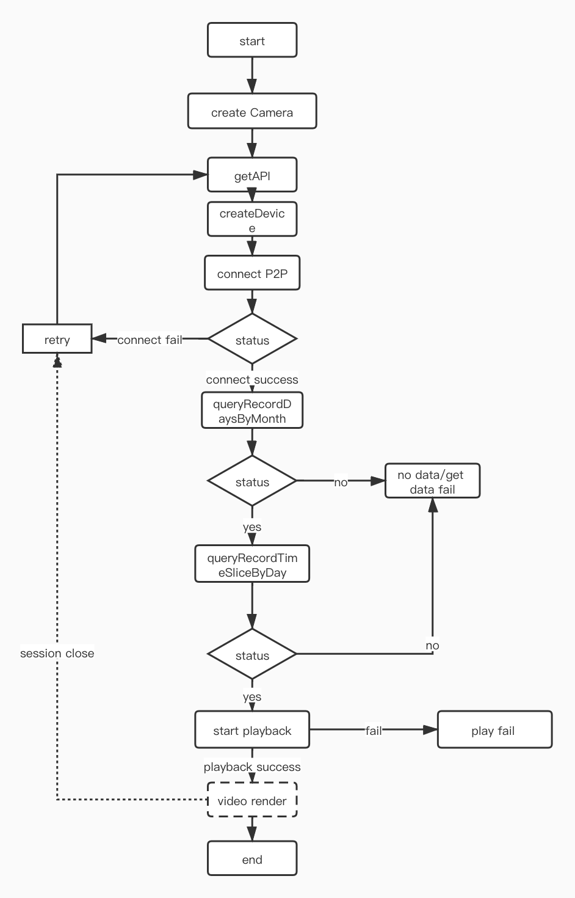

## Playback

Tuya IPC camera supports SD card recording function. After the smart camera inserts the memory card, you can view the information and status of the memory card, and set the recording switch and mode. For details, refer to the [memory card management function](./camera_device_points.md#Memory card and local video recording management).

The memory card playback is based on the **Camera Android** SDK's cloud server information, then creating an ICameraP2P object, and then making a P2P connection, you can play the video recorded by the camera's SD card.


### Video clip

#### Get date with playback video record

Before starting playback, you need to get the information of the playback video record. First get the date with the playback video record.

**Declaration**

```java
void queryRecordDaysByMonth(int year, int month, OperationDelegateCallBack callBack);
```

**Parameter**


|   Parameter   |   Description   |
| -------------- | ---------------- |
| year           | query year      |
| month          | query month     |
| monthcallBack | result callback |

**Example**

```java
int year = Integer.parseInt(substring[0]);
int mouth = Integer.parseInt(substring[1]);
queryDay = Integer.parseInt(substring[2]);
mCameraP2P.queryRecordDaysByMonth(year, mouth, new OperationDelegateCallBack() {
  @Override
  public void onSuccess(int sessionId, int requestId, String data) {
    MonthDays monthDays = JSONObject.parseObject(data, MonthDays.class);
    mBackDataMonthCache.put(mCameraP2P.getMonthKey(), monthDays.getDataDays());
    mHandler.sendMessage(MessageUtil.getMessage(MSG_DATA_DATE, ARG1_OPERATE_SUCCESS, data));
  }

  @Override
  public void onFailure(int sessionId, int requestId, int errCode) {
    mHandler.sendMessage(MessageUtil.getMessage(MSG_DATA_DATE, ARG1_OPERATE_FAIL));
  }
}); 
```

#### Get video playback information for a certain day

After getting the date of useful playback record, get the video playback record of the day according to the date.

**Declaration**

```java
void queryRecordTimeSliceByDay(int year, int month, int day, OperationDelegateCallBack callBack);
```

**Parameter**


|   Parameter   |   Description   |
| -------------- | ---------------- |
| year           | query year      |
| month          | query month     |
| day          | query day     |
| callBack | result callback |


**Example**

```java
int year = Integer.parseInt(substring[0]);
int mouth = Integer.parseInt(substring[1]);
int day = Integer.parseInt(substring[2]);
mCameraP2P.queryRecordTimeSliceByDay(year, mouth, day, new OperationDelegateCallBack() {
  @Override
  public void onSuccess(int sessionId, int requestId, String data) {					
    parsePlaybackData(data);
  }

  @Override
  public void onFailure(int sessionId, int requestId, int errCode) {
    mHandler.sendEmptyMessage(MSG_DATA_DATE_BY_DAY_FAIL);
  }
});
```

### Video playback

#### Start Play back


**Declaration**

```java
void startPlayBack(int startTime, int stopTime, int playTime, OperationDelegateCallBack callBack, OperationDelegateCallBack finishCallBack);
```

**Parameter**


|      Parameter      |   Description    |
| -------------- | --------- |
| startTime  | starting time |
| stopTime  | end time |
| playTime  | play time |
| callBack | playback callback |
| finishcallBack | callback when playback ends |


**Example**


```java
mCameraP2P.startPlayBack(timePieceBean.getStartTime(),
                         timePieceBean.getEndTime(),
                         timePieceBean.getStartTime(), new OperationDelegateCallBack() {
                           @Override
                           public void onSuccess(int sessionId, int requestId, String data){
                             isPlayback = true;
                           }

                           @Override
                           public void onFailure(int sessionId, int requestId, int errCode){
                             isPlayback = false;
                           }
                         }, new OperationDelegateCallBack() {
                           @Override
                           public void onSuccess(int sessionId, int requestId, String data){
                             isPlayback = false;
                           }

                           @Override
                           public void onFailure(int sessionId, int requestId, int errCode){
                             isPlayback = false;
                           }
                         });
```

#### Pause playback


**Declaration**

```java
void pausePlayBack(OperationDelegateCallBack callBack);
```

**Parameter**


|      Parameter      |   Description    |
| -------------- | --------- |
| callBack | result callback |


**Example**


```java
mCameraP2P.pausePlayBack(new OperationDelegateCallBack() {
  @Override
  public void onSuccess(int sessionId, int requestId, String data) {
    isPlayback = false;
  }

  @Override
  public void onFailure(int sessionId, int requestId, int errCode) {

  }
});
```

#### Resume playback


**Declaration**

```java
void resumePlayBack(OperationDelegateCallBack callBack);
```

**Parameter**


|      Parameter      |   Description    |
| -------------- | --------- |
| callBack | result callback |


**Example**

```java
mCameraP2P.resumePlayBack(new OperationDelegateCallBack() {
  @Override
  public void onSuccess(int sessionId, int requestId, String data) {
    isPlayback = true;
  }

  @Override
  public void onFailure(int sessionId, int requestId, int errCode) {

  }
});
```

#### Stop playback


**Declaration**

```java
void stopPlayBack(OperationDelegateCallBack callBack);
```

**Parameter**


|      Parameter      |   Description    |
| -------------- | --------- |
| callBack | result callback |


**Example**

```java
mCameraP2P.stopPlayBack(new OperationDelegateCallBack() {
  @Override
  public void onSuccess(int sessionId, int requestId, String data) {

  }

  @Override
  public void onFailure(int sessionId, int requestId, int errCode) {

  }
});
```

### Flow chart





