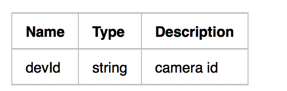

# Obtain relevant parameters


> The parameters p2pID, pwd, localkey, initStr, p2pkey are necessary for the initialization of TuyaCamera SDK. Without the corresponding success of these parameters, the construction of P2P channel can not be successful.

should have the ability to access to tuya public SDK api to get  p2pid, pwd, localkey, initStr, p2pkey.


####  TuyaSmartHomeSDK introduction

TuyaSmartHomeSDK encapsulates Tuya cloud HTTP API interface encapsulation, so TuyaSmartCameraSDK acquisition API needs to use TuyaSmartHomeSDK method, see for details
[TuyaSmartHomeSDK](https://mimimumu.github.io/tuyasmart_home_android_sdk_doc/zh-hans/)


#### method：


access tuya home smart android sdk, initialize sdk，need to use general interface call methords to get camera configurration parameter 

```java 
	TuyaHomeSdk.getRequestInstance().requestWithApiName(String apiName, String version, Map postData, final IRequestCallback callback)
```

 get the api interface which is for p2pid、pwd，localkey,initStr,p2pkey:
 
- interface introduction

	
	
-  call parameter

  

  ```java
  postData:(“devId”,devId)
  ```

-  response


  ```json
  {
  	result = 	{
  		password = "xxxxxx",
  		id = "xxxxxxxxxxxxxxxxxx",
  		p2pConfig = 	{
       		initStr= "xxxxxxxxxxxxxxxxxx",
              p2pKey= "xxxxxxxxxxxxxxxxxx"
  		},
  		p2pId = "XXXXXXXXXXXXXXXXXXX",
  		timeZoneId = "Asia/Shanghai",
  	},
  	success = 1,
  	status = "ok",
  }
  ```
