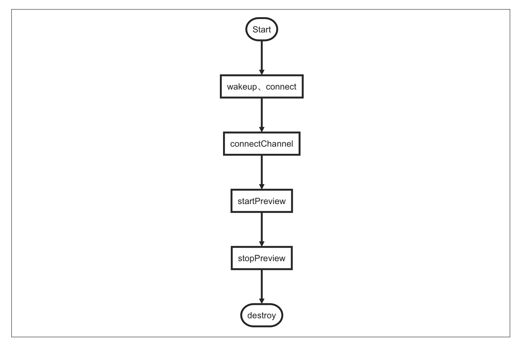

# 低功耗门铃唤醒


## 简介

低功耗门铃由电池供电，为了节省电量，在一定时间内没有 p2p 连接会休眠，休眠后无法直接连接 p2p ，需要通过设备功能点 `wirelessWake` 先唤醒设备，唤醒后再连接 p2p 通道。


## 门铃的唤醒及链接的操作方法


### 门铃的唤醒方法

```java
void wirelessWake(String localkey, String devId); 
```

**参数说明**

| 参数    | 说明                               |
| :------- | :---------------------------------- |
| localkey | 设备 localkey |
| devId | 设备id |

**示例代码**

```java
mDeviceControl = TuyaCameraDeviceControlSDK.getCameraDeviceInstance(devId);
//wake up
mDeviceControl.wirelessWake(localkey, devId); 
//connect
camera.connect(p2pId, p2pWd,localKey);
```


## 流程图


