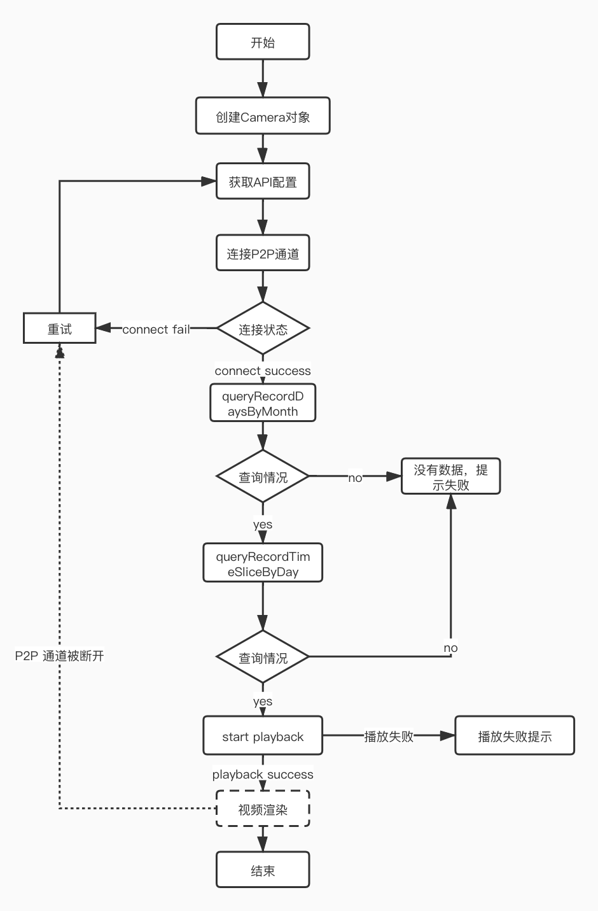

# 存储卡回放

涂鸦 IPC 摄像机支持 SD卡录制功能，智能摄像机插入存储卡后，可以查看存储卡的信息和状态，并设置录像开关和模式，详情可以参考 [存储卡管理功能](./camera_device_points.md#存储卡及本地录像管理)。

存储卡回放是 **Tuya Smart Camera Android SDK **通过云端服务器信息，接着创建 `ICameraP2P` 对象，然后进行 P2P 连接后，就可以播放摄像机 SD 卡录制下来的视频了。


## 主要链路代码

#### 1. 初始化

`ICameraP2P` 需要绑定 `IMonitorView`，使用者要创建 `ICameraP2P` 和 `TuyaCameraView` ，再使用 `TuyaCameraView` 构造 `IMonitorView`，同时也需要注册`OnP2PCameraListener`、`CreateVideoViewCallback` 。

```java
// 创建 ICameraP2P
ICameraP2P mCameraP2P = TuyaSmartCameraP2PFactory.generateTuyaSmartCamera(sdkProvider);
// 创建 TuyaCameraView
TuyaCameraView mVideoView = findViewById(R.id.camera_video_view);

// 为 TuyaCameraView 设置回调，类型为 TuyaCameraView.CreateVideoViewCallback
mVideoView.setCameraViewCallback(this);
// 使用 TuyaCameraView 构造 IMonitorView
mVideoView.createVideoView(sdkProvider);

...

// TuyaCameraView 构造 IMonitorView 完成时回调
@Override
public void onCreated(Object view) {
  if (null != mCameraP2P){
    // 为 ICameraP2P 绑定 IMonitorView
    mCameraP2P.generateCameraView(view);
  }
}
```


#### 2. 获取设备信息，并创建设备

通过调用云端接口，获取设备配置相关信息后创建设备。

```java
// 获取设备配置相关信息
private void getApi() {
    mSmartCameraP2P = new TuyaSmartCameraP2P();
    mSmartCameraP2P.requestCameraInfo(devId, new ICameraConfig() {
        @Override
        public void onFailure(BusinessResponse var1, ConfigCameraBean var2, String var3) {
            ToastUtil.shortToast(CameraPanelActivity.this, "get cameraInfo failed");
        }

        @Override
        public void onSuccess(BusinessResponse var1, ConfigCameraBean var2, String var3) {
            p2pWd = var2.getPassword();
            p2pId = var2.getP2pId();
            //创建设备
            initCameraView(var2);
        }
    });
}

private void initCameraView(ConfigCameraBean bean) {
    mCameraP2P.createDevice(new OperationDelegateCallBack() {
        @Override
        public void onSuccess(int sessionId, int requestId, String data) {
            mHandler.sendMessage(MessageUtil.getMessage(MSG_CREATE_DEVICE, ARG1_OPERATE_SUCCESS));
        }

        @Override
        public void onFailure(int sessionId, int requestId, int errCode) {
            mHandler.sendMessage(MessageUtil.getMessage(MSG_CREATE_DEVICE, ARG1_OPERATE_FAIL));
        }
    },bean);
}
```


#### 3. P2P 连接

在开始视频播放之前，需要先连接 P2P 通道。P2P 状态需要使用者自己维护，SDK 只负责下发指令和接收摄像机响应结果。

```java
mCameraP2P.connect(new OperationDelegateCallBack() {
  @Override
  public void onSuccess(int sessionId, int requestId, String data) {
    mHandler.sendMessage(MessageUtil.getMessage(MSG_CONNECT, ARG1_OPERATE_SUCCESS));
  }

  @Override
  public void onFailure(int sessionId, int requestId, int errCode) {
    mHandler.sendMessage(MessageUtil.getMessage(MSG_CONNECT, ARG1_OPERATE_FAIL, errCode));
  }
});
```


#### 4. 获取有回放视频记录的日期

调用queryRecordDaysByMonth方法

```java
int year = Integer.parseInt(substring[0]);
int mouth = Integer.parseInt(substring[1]);
queryDay = Integer.parseInt(substring[2]);
mCameraP2P.queryRecordDaysByMonth(year, mouth, new OperationDelegateCallBack() {
  @Override
  public void onSuccess(int sessionId, int requestId, String data) {
    //data是获取到的月份数据
    MonthDays monthDays = JSONObject.parseObject(data, MonthDays.class);
    mBackDataMonthCache.put(mCameraP2P.getMonthKey(), monthDays.getDataDays());
    mHandler.sendMessage(MessageUtil.getMessage(MSG_DATA_DATE, ARG1_OPERATE_SUCCESS, data));
  }

  @Override
  public void onFailure(int sessionId, int requestId, int errCode) {
    mHandler.sendMessage(MessageUtil.getMessage(MSG_DATA_DATE, ARG1_OPERATE_FAIL));
  }
}); 
```

   > 在开始回放前，需要获取到回放视频记录的信息。首先获取有回放视频记录的日期


#### 5. 获取某日的视频回放信息

```java
int year = Integer.parseInt(substring[0]);
int mouth = Integer.parseInt(substring[1]);
int day = Integer.parseInt(substring[2]);
mCameraP2P.queryRecordTimeSliceByDay(year, mouth, day, new OperationDelegateCallBack() {
  @Override
  public void onSuccess(int sessionId, int requestId, String data) {					//data是获取到的日期时间片段数据
    parsePlaybackData(data);
  }

  @Override
  public void onFailure(int sessionId, int requestId, int errCode) {
    mHandler.sendEmptyMessage(MSG_DATA_DATE_BY_DAY_FAIL);
  }
});
```

   > 获取到有用回放记录的日期后，根据日期获取当日的视频回放记录


#### 6. 开启回放

```java
mCameraP2P.startPlayBack(timePieceBean.getStartTime(),
                         timePieceBean.getEndTime(),
                         timePieceBean.getStartTime(), new OperationDelegateCallBack() {
                           @Override
                           public void onSuccess(int sessionId, int requestId, String data){
                             isPlayback = true;
                           }

                           @Override
                           public void onFailure(int sessionId, int requestId, int errCode){
                             isPlayback = false;
                           }
                         }, new OperationDelegateCallBack() {
                           @Override
                           public void onSuccess(int sessionId, int requestId, String data){
                             isPlayback = false;
                           }

                           @Override
                           public void onFailure(int sessionId, int requestId, int errCode){
                             isPlayback = false;
                           }
                         });
```


#### 7. 暂停回放

```java
mCameraP2P.pausePlayBack(new OperationDelegateCallBack() {
  @Override
  public void onSuccess(int sessionId, int requestId, String data) {
    isPlayback = false;
  }

  @Override
  public void onFailure(int sessionId, int requestId, int errCode) {

  }
});
```


#### 8. 恢复回放

   ```java
mCameraP2P.resumePlayBack(new OperationDelegateCallBack() {
  @Override
  public void onSuccess(int sessionId, int requestId, String data) {
    isPlayback = true;
  }

  @Override
  public void onFailure(int sessionId, int requestId, int errCode) {

  }
});
   ```

 

#### 9. 结束回放

   ```java
mCameraP2P.stopPlayBack(new OperationDelegateCallBack() {
  @Override
  public void onSuccess(int sessionId, int requestId, String data) {

  }

  @Override
  public void onFailure(int sessionId, int requestId, int errCode) {

  }
});
   ```


#### 10. 断开P2P连接

disconnect 断开连线，离开页面的时候可以选择断开 p2p 连接。

   ```java
mCameraP2P.disconnect(new OperationDelegateCallBack() {
  @Override
  public void onSuccess(int sessionId, int requestId, String data) {

  }

  @Override
  public void onFailure(int sessionId, int requestId, int errCode) {

  }
});
   ```


#### 11. 销毁ICameraP2P对象

destroy 销毁对象，不再使用 camera 功能的时候，一定要调用 destroy

```java
TuyaSmartCameraP2PFactory.onDestroyTuyaSmartCamera();   
```


## 流程图




## 开启回放成功后，可调用信令


#### 开启视频录制

调用 startRecordLocalMp4 方法。

**示例代码**

```java
if (Constants.hasStoragePermission()) {
                String picPath = Environment.getExternalStorageDirectory().getAbsolutePath() + "/Camera/";
                File file = new File(picPath);
                if (!file.exists()) {
                    file.mkdirs();
                }
                String fileName = System.currentTimeMillis() + ".mp4";
                videoPath = picPath + fileName;
                mCameraP2P.startRecordLocalMp4(picPath, fileName, CameraPanelActivity.this, new OperationDelegateCallBack() {
                    @Override
                    public void onSuccess(int sessionId, int requestId, String data) {
                        isRecording = true;
                        mHandler.sendEmptyMessage(MSG_VIDEO_RECORD_BEGIN);

                    }

                    @Override
                    public void onFailure(int sessionId, int requestId, int errCode) {
                        mHandler.sendEmptyMessage(MSG_VIDEO_RECORD_FAIL);
                    }
                });
                recordStatue(true);
            } else {
                Constants.requestPermission(CameraPanelActivity.this, Manifest.permission.WRITE_EXTERNAL_STORAGE, Constants.EXTERNAL_STORAGE_REQ_CODE, "open_storage");
            } 
```

> 注：录制视频需要写存储卡权限


#### 停止视频录制

调用stopRecordLocalMp4方法。

**示例代码**

```java
mCameraP2P.stopRecordLocalMp4(new OperationDelegateCallBack() {
                @Override
                public void onSuccess(int sessionId, int requestId, String data) {
                    isRecording = false;
                    //data 返回的是文件路径
                    mHandler.sendMessage(MessageUtil.getMessage(MSG_VIDEO_RECORD_OVER, ARG1_OPERATE_SUCCESS, data));
                }

                @Override
                public void onFailure(int sessionId, int requestId, int errCode) {
                    isRecording = false;
                    mHandler.sendMessage(MessageUtil.getMessage(MSG_VIDEO_RECORD_OVER, ARG1_OPERATE_FAIL));
                }
            });
```


#### 视频截图

调用snapshot方法，来截图。

**示例代码**

```java
if (Build.VERSION.SDK_INT >= Build.VERSION_CODES.KITKAT) {
            String path = Environment.getExternalStorageDirectory().getAbsolutePath() + "/Camera/";
            File file = new File(path);
            if (!file.exists()) {
                file.mkdirs();
            }
            picPath = path;
        }
        mCameraP2P.snapshot(picPath, CameraPanelActivity.this, ICameraP2P.PLAYMODE.LIVE, new OperationDelegateCallBack() {
            @Override
            public void onSuccess(int sessionId, int requestId, String data) {
             //data 返回的是文件路径
                mHandler.sendMessage(MessageUtil.getMessage(MSG_SCREENSHOT, ARG1_OPERATE_SUCCESS, data));
            }

            @Override
            public void onFailure(int sessionId, int requestId, int errCode) {
                mHandler.sendMessage(MessageUtil.getMessage(MSG_SCREENSHOT, ARG1_OPERATE_FAIL));
            }
        });
```


#### 设置拾音器状态

设置设备传过来的声音开关

**示例代码**

```java
        int mute;
        mute = previewMute == ICameraP2P.MUTE ? ICameraP2P.UNMUTE : ICameraP2P.MUTE;
        mCameraP2P.setMute(ICameraP2P.PLAYMODE.LIVE, mute, new OperationDelegateCallBack() {
            @Override
            public void onSuccess(int sessionId, int requestId, String data) {
            		//data返回的是对应操作之后的结果值
                previewMute = Integer.valueOf(data);
                mHandler.sendMessage(MessageUtil.getMessage(MSG_MUTE, ARG1_OPERATE_SUCCESS));
            }

            @Override
            public void onFailure(int sessionId, int requestId, int errCode) {
                mHandler.sendMessage(MessageUtil.getMessage(MSG_MUTE, ARG1_OPERATE_FAIL));
            }
        });
```


