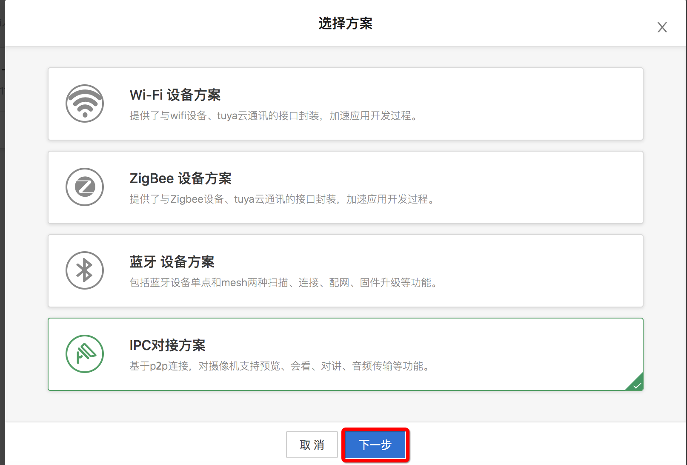
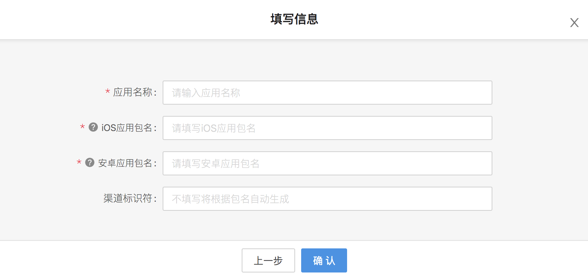

#  集成准备

## 创建SDK应用

1. 在涂鸦iot平台中“App工作台”中点击App SDK,点击“获取SDK”

2. 根据需求选择合适的开发方案，点击“下一步”。

3. 根据提示输入创建的app信息，点击”下一步“。

4. 在安卓部分可以获取AppKey、AppSecret。点击"下载安全图片"，“Android 下载（Gradle）”下载所需要的安全图片和依赖包信息。

	