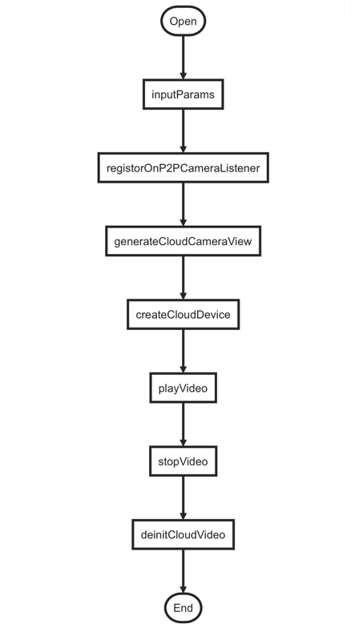

# 侦测报警

涂鸦智能摄像机通常具有侦测报警的功能，可以通过设备功能点打开侦测开关。侦测告警主要分两种，声音检测和移动检测。当设备检测到声音或者物体移动时，会上报一个警告消息，如果你的 App 集成了推送功能，App 还会收到一个推送通知。集成推送请参考[集成 Push](https://tuyainc.github.io/tuyasmart_home_android_sdk_doc/zh-hans/resource/Push.html)。

报警消息通常会附带一张当前视频的截图。

直供电门铃设备，提供视频消息的能力。当有人按下门铃时，设备可以上传一段留言视频，这个消息也会通过报警消息获取到，消息体会附带一段 6 秒的加密视频。


## 消息列表


### 模块引用

```groovy
implementation 'com.tuya.smart:tuyasmart-ipc-camera-message:3.13.0r128'
```


### 消息日历

可以通过 Camera SDK 查询到某年某月有报警消息的日期，以便于在日历上直观展示。

**接口说明**

获取摄像机消息中心指定月含有消息的具体日期列表

```java
void queryAlarmDetectionDaysByMonth(String jsonParams, ResultListener<JSONArray> listener)
```

**参数说明**

|   参数   | 类型   | 必传 | 说明                            |
| :------ | :------ | :---- | :------------------------------- |
| msgSrcId | String | 必须 | devId(设备 ID)                  |
|  month   | String | 必须 | 年月,中间以 - 拼接,例如: 2019-8 |
| timeZone | String | 必须 | 时区, 例如: Asia/Shanghai       |

然后将其**整体**包含在 **json** 字段中，例如

```java
JSONObject object = new JSONObject();
object.put("msgSrcId", devId);
object.put("timeZone", TimeZoneUtils.getTimezoneGCMById(TimeZone.getDefault().getID()));
object.put("month", year + "-" + month);
messageBusiness.queryAlarmDetectionDaysByMonth(object.toJSONString(),
new Business.ResultListener<JSONArray>() {
    @Override
    public void onFailure(BusinessResponse businessResponse, JSONArray objects, String s) {
        mHandler.sendEmptyMessage(ALARM_DETECTION_DATE_MONTH_FAILED);
    }

    @Override
    public void onSuccess(BusinessResponse businessResponse, JSONArray objects, String s) {
        List<Integer> dates = JSONArray.parseArray(objects.toJSONString(), Integer.class);
        if (dates.size() > 0){
            day = dates.get(0);
        }
        mHandler.sendEmptyMessage(ALARM_DETECTION_DATE_MONTH_SUCCESS);
    }
});
```

返回数据结构示例（具体以实际请求为准）

```json
*** JSON示例 ***
{
	"result": ["20"],
	"t": 1564390878414,
	"success": true,
	"status": "ok"
}
```


### 消息类型

侦测报警消息根据触发方式定义有多种类型，部分类型又可以划分为一个大的分类。Camera SDK 提供获取默认分类的列表，以便于分类查询报警消息。

**接口说明**

获取消息类型

```java
void queryAlarmDetectionClassify(String devId, ResultListener<ArrayList<CameraMessageClassifyBean>> listener)
```

**参数说明**

| 参数  | 类型   | 必传 | 描述             |
| :--- | :------ | :-------- | :---------------- |
| devId | String | 必须     | devId（设备 ID） |

然后将其**整体**包含在 **json** 字段中，例如

```java
public void queryCameraMessageClassify(String devId) {
    if (messageBusiness != null) {
        messageBusiness.queryAlarmDetectionClassify(devId, new Business.ResultListener<ArrayList<CameraMessageClassifyBean>>() {
            @Override
            public void onFailure(BusinessResponse businessResponse, ArrayList<CameraMessageClassifyBean> cameraMessageClassifyBeans, String s) {
                mHandler.sendEmptyMessage(MOTION_CLASSIFY_FAILED);
            }

            @Override
            public void onSuccess(BusinessResponse businessResponse, ArrayList<CameraMessageClassifyBean> cameraMessageClassifyBeans, String s) {
                selectClassify = cameraMessageClassifyBeans.get(0);
                mHandler.sendEmptyMessage(MOTION_CLASSIFY_SUCCESS);
            }
        });
    }
}
```

返回数据结构示例（具体以实际请求为准）

```json
*** JSON示例 ***
{
	"result": [{
		"describe": "All"
	}, {
		"describe": "Motion",
		"msgCode": ["ipc_motion", "ipc_linger", "ipc_passby", "ipc_human", "ipc_car", "ipc_cat", "MOVEMENT_DETECT_MSG"]
	}, {
		"describe": "Talk",
		"msgCode": ["ipc_connected", "ipc_unconnected", "ipc_refuse", "ipc_doorbell", "ipc_leave_msg"]
	}],
	"t": 1564390878289,
	"success": true,
	"status": "ok"
}
```

返回数据封装在 CameraMessageClassifyBean，格式说明如下

**CameraMessageClassifyBean 数据模型**

| 字段     | 描述     |
| :-------- | :-------- |
| describe | 消息描述 |
| msgCode  | 无需关注 |
| selected | 无需关注 |


### 消息列表

可以通过 Camera SDK 查询和删除侦测报警消息。

#### 获取侦测报警消息列表

**接口说明**

```java
void getAlarmDetectionMessageList(String json, ResultListener<JSONObject> listener)
```

**参数说明**

|   参数    | 类型     | 必传 | 说明              |
| :------- | :-------- | :-------- | :--------------------------------- |
| msgSrcId  | String   | 必须     | devId (设备 ID)                                              |
|  msgType  | Int      | 必须     | 消息类型，目前只要传4即可                                    |
|   limit   | Int      | 必须     | 请求的数量                                                   |
|  offset   | Int      | 必须     | 请求的偏移量,用来做分页                                      |
| startTime | Long     | 必须     | 起始时间 传 Unix 时间戳,秒级                                 |
|  endTime  | Long     | 必须     | 结束时间 传 Unix 时间戳,秒级                                 |
| msgCodes  | String[] | 可选     | 如果不传,默认请求所有类型的数据,如果传了,则请求对应类型的消息数据(消息数组可以查看消息类型接口介绍) |

>  PS: 如果要查询某一天的全部消息数据，可以将结束时间和起始时间间隔一天的时间戳即可。然后将其**整体**包含在 **json** 字段中，例如

```java
if (null != messageBusiness){
    long startTime = DateUtils.getTodayStart(day);
    long endTime = DateUtils.getTodayEnd(day) - 1L;
    JSONObject object = new JSONObject();
    object.put("msgSrcId", devId);
    object.put("startTime", startTime);
    object.put("endTime", endTime);
    object.put("msgType", 4);
    object.put("limit", 30);
    object.put("keepOrig", true);
    object.put("offset", offset);
    if (null != selectClassify) {
        object.put("msgCodes", selectClassify.getMsgCode());
    }
    messageBusiness.getAlarmDetectionMessageList(object.toJSONString(), new Business.ResultListener<JSONObject>() {
        @Override
        public void onFailure(BusinessResponse businessResponse, JSONObject jsonObject, String s) {
            mHandler.sendMessage(MessageUtil.getMessage(MSG_GET_ALARM_DETECTION, ARG1_OPERATE_FAIL));
        }

        @Override
        public void onSuccess(BusinessResponse businessResponse, JSONObject jsonObject, String s) {
            List<CameraMessageBean> msgList;
            try {
                msgList = JSONArray.parseArray(jsonObject.getString("datas"), CameraMessageBean.class);
            } catch (Exception e) {
                msgList = null;
            }
            if (msgList != null) {
                offset += msgList.size();
                mHandler.sendMessage(MessageUtil.getMessage(MSG_GET_ALARM_DETECTION, ARG1_OPERATE_SUCCESS));
            } else {
                mHandler.sendMessage(MessageUtil.getMessage(MSG_GET_ALARM_DETECTION, ARG1_OPERATE_FAIL));
            }
        }
    });
}
```

返回数据结构示例（具体以实际请求为准）

```json
*** JSON示例 ***
 {
	"result" : {
		"datas" : [ {
		"actionURL" : "tuyaSmart://panel?devId=6c659ecc586a7da3b5pawj",
		"msgContent" : "开关打开",
		"msgType" : 4,
		"time" : 1512639767,
		"icon" : "https://images.tuyacn.com/smart/product_icon/kt.png",
		"dateTime" : "2017-12-7 17:42",
		"id" : 3261004,
		"msgSrcId" : "6c659ecc586a7da3b5pawj",
    "msgTypeContent" : "告警测试"
}, {
     "actionURL" : "tuyaSmart://panel?devId=6c659ecc586a7da3b5pawj",
		"msgContent" : "开关打开",
		"msgType" : 4,
		"time" : 1511420861,
    "icon" : "https://images.tuyacn.com/smart/product_icon/kt.png",
		"dateTime" : "2017-11-23 15:07",
    "id" : 2967004,
    "msgSrcId" : "6c659ecc586a7da3b5pawj",
		"msgTypeContent" : "告警测试"
} ],
	"totalCount" : 2
},
	"t" : 1539243923807,
	"success" : true,
	"status" : "ok"
}
```

返回数据已经封装在 CameraMessageBean 中，格式如下

**CameraMessageBean 数据模型**

| 参数           | 说明                                       |
| :-------------- | :------------------------------------------ |
| dateTime       | 发生日期                                   |
| msgTypeContent | 无需关注                                   |
| msgType        | 无需关注                                   |
| time           | 发生事件的时间戳                           |
| attachPics     | 消息事件的图片，数组格式，取第一个数据     |
| attachVideos   | 消息事件的视频数据，数组格式，取第一个数据 |
| actionURL      | /                                          |
| id             | 事件 ID                                    |
| msgSrcId       | 消息 ID                                    |


#### 批量删除报警消息

**接口说明**

```java
void deleteAlarmDetectionMessageList(String ids, ResultListener<Boolean> listener)
```

**参数说明**

| 参数 | 类型   | 必传 | 说明                             |
| :-- | :------ | :-------- | :-------------------------------- |
| ids  | String | 必须     | 字符串，多个消息 id 用逗号，分隔 |

其**整体**包含在 **json** 字段中，例如

```java
StringBuilder ids = new StringBuilder();
for (int i = 0; i < mWaitingDeleteCameraMessageList.size(); i++) {
    ids.append(mWaitingDeleteCameraMessageList.get(i).getId());
    if (i != mWaitingDeleteCameraMessageList.size() - 1) {
        ids.append(",");
    }
}
messageBusiness.deleteAlarmDetectionMessageList(ids.toString(), new Business.ResultListener<Boolean>() {
                @Override
                public void onFailure(BusinessResponse businessResponse, Boolean aBoolean, String s) {
                    mHandler.sendMessage(MessageUtil.getMessage(MSG_DELETE_ALARM_DETECTION, ARG1_OPERATE_FAIL));
                }

                @Override
                public void onSuccess(BusinessResponse businessResponse, Boolean aBoolean, String s) {
                    mCameraMessageList.removeAll(mWaitingDeleteCameraMessageList);
                    mWaitingDeleteCameraMessageList.clear();
                    mHandler.sendMessage(MessageUtil.getMessage(MSG_DELETE_ALARM_DETECTION, ARG1_OPERATE_SUCCESS));
                }
            });
```

返回数据结构示例（具体以实际请求为准）

```json
*** JSON示例 ***
{
	"result" : true,
	"t" : 1548058543873,
	"success" : true,
	"status" : "ok"
}
```


## 视频消息

**接口说明**

注册监听器，只有注册之后才能获取到视频播放的回调数据

```java
void registorOnP2PCameraListener(OnP2PCameraListener listener);
```

**参数说明**

| 参数           | 说明             |
| :------------------- | :---------------- |
| OnP2PCameraListener | 视频播放回调数据 |

**接口说明**

注入播放器 View，用来渲染视频画面

```java
void generateCloudCameraView(IRegistorIOTCListener view);
```

**参数说明**

| 参数              | 说明       |
| :--------------------- | :---------- |
| IRegistorIOTCListener | 播放器组件 |

**接口说明**

创建云视频播放设备

```java
void createCloudDevice(String cachePath, String devId, OperationDelegateCallBack callBack);
```

**参数说明**

| 参数                      | 说明         |
| :------------------------- | :------------ |
| cachePath                 | 缓存文件地址 |
| devId                     | 设备 id      |
| OperationDelegateCallBack | 操作回调     |

**示例代码**

```kotlin
cloudVideo?.createCloudDevice(cachePath, devId, object : OperationDelegateCallBack {
  override fun onSuccess(sessionId: Int, requestId: Int, data: String) {
    mHandler.sendMessage(MessageUtil.getMessage(ICameraVideoPlayModel.MSG_CLOUD_MEDIA_DEVICE, ICameraVideoPlayModel.OPERATE_SUCCESS, data))
  }

  override fun onFailure(sessionId: Int, requestId: Int, errCode: Int) {
    mHandler.sendMessage(MessageUtil.getMessage(ICameraVideoPlayModel.MSG_CLOUD_MEDIA_DEVICE, ICameraVideoPlayModel.OPERATE_FAIL, errCode))
  }
})
```

**接口说明**

播放报警消息中的视频

```java
void playVideo(String videoUrl, int startTime, String encryptKey, OperationCallBack callback, OperationCallBack playFinishedCallBack);
```

**参数说明**

| 参数                 | 说明                    |
| :-------------------- | :----------------------- |
| videoUrl             | 视频播放地址            |
| startTime            | 开始播放时间，初始值：0 |
| encryptKey           | 播放视频的秘钥          |
| callback             | 操作回调                |
| playFinishedCallBack | 结束播放的操作回调      |

**示例代码**

```kotlin
override fun playVideo(videoUrl: String, startTime: Int, encryptKey: String) {
  if (cloudVideo == null) {
    return
  }
  cloudVideo!!.playVideo(videoUrl, startTime, encryptKey, object : OperationCallBack {
    override fun onSuccess(sessionId: Int, requestId: Int, data: String, camera: Any) {
      playState = CloudPlayState.STATE_PLAYING
      mHandler.sendMessage(MessageUtil.getMessage(ICameraVideoPlayModel.MSG_CLOUD_VIDEO_PLAY, ICameraVideoPlayModel.OPERATE_SUCCESS))
    }

    override fun onFailure(sessionId: Int, requestId: Int, errCode: Int, camera: Any) {
      playState = CloudPlayState.STATE_ERROR
      mHandler.sendMessage(MessageUtil.getMessage(ICameraVideoPlayModel.MSG_CLOUD_VIDEO_PLAY, ICameraVideoPlayModel.OPERATE_FAIL))
    }
  }, object : OperationCallBack {
    override fun onSuccess(sessionId: Int, requestId: Int, data: String, camera: Any) {
      playState = CloudPlayState.STATE_COMPLETED
      mHandler.sendMessage(MessageUtil.getMessage(ICameraVideoPlayModel.MSG_CLOUD_VIDEO_STOP, ICameraVideoPlayModel.OPERATE_SUCCESS))
    }

    override fun onFailure(sessionId: Int, requestId: Int, errCode: Int, camera: Any) {
      mHandler.sendMessage(MessageUtil.getMessage(ICameraVideoPlayModel.MSG_CLOUD_VIDEO_STOP, ICameraVideoPlayModel.OPERATE_FAIL))
    }
  })
}
```

**接口说明**

暂停播放

```java
void pauseVideo(OperationCallBack callback);
```

**参数说明**

| 参数                 | 说明 |
| :------------------------- | :-------- |
| OperationDelegateCallBack | 操作回调 |

**示例代码**

```kotlin
override fun pauseVideo() {
  if (cloudVideo == null) {
    return
  }
  cloudVideo!!.pauseVideo(object : OperationCallBack {
    override fun onSuccess(sessionId: Int, requestId: Int, data: String, camera: Any) {
      playState = CloudPlayState.STATE_PAUSED
      mHandler.sendMessage(MessageUtil.getMessage(ICameraVideoPlayModel.MSG_CLOUD_VIDEO_PAUSE, ICameraVideoPlayModel.OPERATE_SUCCESS))
    }

    override fun onFailure(sessionId: Int, requestId: Int, errCode: Int, camera: Any) {
      mHandler.sendMessage(MessageUtil.getMessage(ICameraVideoPlayModel.MSG_CLOUD_VIDEO_PAUSE, ICameraVideoPlayModel.OPERATE_FAIL))
    }
  })
}
```

**接口说明**

恢复播放

```java
void resumeVideo(OperationCallBack callback);
```

**参数说明**

| 参数                  | 说明 |
| :------------------------- | :-------- |
| OperationDelegateCallBack | 操作回调 |

**示例代码**

```kotlin
override fun resumeVideo() {
  if (cloudVideo == null) {
    return
  }
  cloudVideo!!.resumeVideo(object : OperationCallBack {
    override fun onSuccess(sessionId: Int, requestId: Int, data: String, camera: Any) {
      playState = CloudPlayState.STATE_PLAYING
      mHandler.sendMessage(MessageUtil.getMessage(ICameraVideoPlayModel.MSG_CLOUD_VIDEO_RESUME, ICameraVideoPlayModel.OPERATE_SUCCESS))
    }

    override fun onFailure(sessionId: Int, requestId: Int, errCode: Int, camera: Any) {
      mHandler.sendMessage(MessageUtil.getMessage(ICameraVideoPlayModel.MSG_CLOUD_VIDEO_RESUME, ICameraVideoPlayModel.OPERATE_FAIL))
    }
  })
}
```

**接口说明**

停止播放

```java
void stopVideo(OperationCallBack callback);
```

**参数说明**

| 参数                  | 说明 |
| :------------------------- | :-------- |
| OperationDelegateCallBack | 操作回调 |

**示例代码**

```kotlin
override fun stopVideo() {
  if (cloudVideo == null) {
    return
  }
  cloudVideo!!.stopVideo(object : OperationCallBack {
    override fun onSuccess(sessionId: Int, requestId: Int, data: String, camera: Any) {
      playState = CloudPlayState.STATE_STOP
      mHandler.sendMessage(MessageUtil.getMessage(ICameraVideoPlayModel.MSG_CLOUD_VIDEO_STOP, ICameraVideoPlayModel.OPERATE_SUCCESS))
    }

    override fun onFailure(sessionId: Int, requestId: Int, errCode: Int, camera: Any) {
      mHandler.sendMessage(MessageUtil.getMessage(ICameraVideoPlayModel.MSG_CLOUD_VIDEO_STOP, ICameraVideoPlayModel.OPERATE_FAIL))
    }
  })
}
```

**接口说明**

设置视频播放的声音开关

```java
void setCloudVideoMute(int mute, OperationDelegateCallBack callBack);
```

**参数说明**

| 参数                  | 说明                                                     |
| :------------------------- | :------------------------------------------------------------ |
| mute                      | 拾音器模式: ICameraP2P.MUTE/ICameraP2P.UNMUTE（静音/非静音） |
| OperationDelegateCallBack | 操作回调                                                     |

**示例代码**

```kotlin
private fun setCloudVideoMute(voiceMode: Int) {
  if (cloudVideo == null) {
    return
  }
  cloudVideo!!.setCloudVideoMute(voiceMode, object : OperationDelegateCallBack {

    override fun onSuccess(sessionId: Int, requestId: Int, data: String) {
      mHandler.sendMessage(MessageUtil.getMessage(ICameraVideoPlayModel.MSG_CLOUD_VIDEO_MUTE, IPanelModel.ARG1_OPERATE_SUCCESS, data))
    }

    override fun onFailure(sessionId: Int, requestId: Int, errCode: Int) {
      mHandler.sendMessage(MessageUtil.getMessage(ICameraVideoPlayModel.MSG_CLOUD_VIDEO_MUTE, IPanelModel.ARG1_OPERATE_FAIL))
    }
  })
}
```


**接口说明**

当云视频不再使用的时候，销毁云视频播放设备

```java
void deinitCloudVideo();
```


**接口说明**

视频数据回调

```kotlin
override fun onReceiveFrameYUVData(sessionId: Int, y: ByteBuffer, u: ByteBuffer, v: ByteBuffer, width: Int, height: Int, nFrameRate: Int, nIsKeyFrame: Int, timestamp: Long, nProgress: Long, nDuration: Long, camera: Any)
```

**参数说明**

| 参数        | 说明                             |
| :----------- | :-------------------------------- |
| sessionId   | \                                |
| Y           | 视频Y数据                        |
| u           | 视频U数据                        |
| v           | 视频V数据                        |
| width       | 视频画面的宽                     |
| height      | 视频画面的高                     |
| nFrameRate  | 帧率                             |
| nIsKeyFrame | 是否I帧                          |
| timestamp   | 时间戳                           |
| nProgress   | 时间进度(消息中心视频播放的进度) |
| nDuration   | 时长(消息中心视频播放时长)       |
| camera      | \                                |

  > 在这里的视频播放只要关心 nProgress，nDuration 即可

**示例代码**

  ```kotlin
override fun onReceiveFrameYUVData(sessionId: Int, y: ByteBuffer, u: ByteBuffer, v: ByteBuffer, width: Int, height: Int, nFrameRate: Int, nIsKeyFrame: Int, timestamp: Long, nProgress: Long, nDuration: Long, camera: Any) {
  val map = HashMap<String, Long>(2)
  map["progress"] = nProgress
  map["duration"] = nDuration
  mHandler.sendMessage(MessageUtil.getMessage(ICameraVideoPlayModel.MSG_CLOUD_VIDEO_INFO, ICameraVideoPlayModel.OPERATE_SUCCESS, map))
}
  
  ```


**流程图**




### 报警消息与存储卡回放

报警消息和存储卡回放没有直接联系，唯一的关联是在存储卡事件录制模式的情况下，报警消息和存储卡视频录制的触发原因和时间点是一样的。

报警消息保存在涂鸦云端，存储卡视频录像保存在摄像机的存储卡中，且存储卡中的视频在容量不足时，可能会被覆盖。存储卡录制的开关和侦测报警的开关也没有关联，所以即使在存储卡事件录制的模式下，报警消息和存储卡中的视频录像也不是一一对应的。

但是存在报警消息发生的时间点有视频录像的情况，Camera SDK 并不提供这种关联查找的接口，开发者可以通过报警消息的触发时间，在当天的存储卡录像视频片段中查找是否有对应的视频录像来建立这种关联。